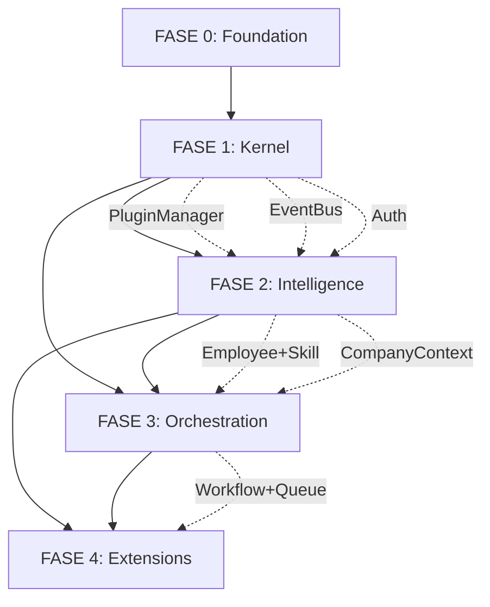

# 🗺️ ENGINE_ROADMAP.md - Roteiro Oficial AIPENSA Engine

**Versão:** 1.0  
**Base:** ENGINE_SPEC.md + ENGINE_ARCHITECTURE.md + ENGINE_API_CONTRACT.md + ENGINE_PLUGIN_GUIDE.md + ENGINE_EVENTS.md  
**Data:** 28 Julho 2026  
**Status:** APROVADO PARA EXECUÇÃO  

---

## 🎯 VISÃO GERAL DAS FASES

```
┌─────────────────────────────────────────────────────────────────────────────────┐
│                        AIPENSA ENGINE ROADMAP                                    │
├──────────────┬──────────────┬──────────────┬──────────────┬────────────────────┤
│    FASE 0    │    FASE 1    │    FASE 2    │    FASE 3    │      FASE 4        │
│  FOUNDATION  │    KERNEL    │ INTELLIGENCE │ ORCHESTRATION│   EXTENSIONS       │
├──────────────┼──────────────┼──────────────┼──────────────┼────────────────────┤
│ ✅ Docs      │ 🏗️ Runtime   │ 🤖 Employees │ 🔄 Workflows │ 🌐 Providers       │
│ ✅ Specs     │ 📦 ModuleReg │ 🧠 Skills    │ ⏰ Scheduler │ 🔌 Plugins Market  │
│ ✅ API       │ 🚌 EventBus  │ 🏢 CompanyCtx│ 📋 Queue     │ 📊 Observability   │
│ ✅ Plugin    │ 🔌 PluginMgr │ 👥 Teams     │ 📈 Metrics   │ 🛡️ Security/Compliance│
│ ✅ Events    │ 🔐 Auth/WS   │ 💬 Chat/Conv │ 🎨 Visual    │ 🚀 Production Ready│
│ ✅ Roadmap   │ 🧪 Tests     │ 🧪 Tests     │ 🧪 Tests     │ 📚 Docs/Training   │
├──────────────┼──────────────┼──────────────┼──────────────┼────────────────────┤
│  2 semanas   │  4 semanas   │  6 semanas   │  6 semanas   │    8 semanas       │
│   (DONE)     │  (CURRENT)   │              │              │                    │
└──────────────┴──────────────┴──────────────┴──────────────┴────────────────────┘
                           TOTAL: ~26 semanas (~6.5 meses)
```

---

## 📋 FASE 0 - ENGINE FOUNDATION (CONCLUÍDA ✅)

### Entregáveis Completados

| Documento | Status | Arquivo | Validação |
|-----------|--------|---------|-----------|
| **ENGINE_SPEC.md** | ✅ Concluído | `ENGINE_SPEC.md` | Philosophy, responsibilities, rules |
| **ENGINE_ARCHITECTURE.md** | ✅ Concluído | `ENGINE_ARCHITECTURE.md` | 6-layer arch, data flows, deploy |
| **ENGINE_API_CONTRACT.md** | ✅ Concluído | `ENGINE_API_CONTRACT.md` | REST + WebSocket, models, errors |
| **ENGINE_PLUGIN_GUIDE.md** | ✅ Concluído | `ENGINE_PLUGIN_GUIDE.md` | 11 plugin types, examples |
| **ENGINE_EVENTS.md** | ✅ Concluído | `ENGINE_EVENTS.md` | ~190 event types catalog |
| **ENGINE_ROADMAP.md** | 🔄 Em progresso | `ENGINE_ROADMAP.md` | Este documento |

### Revisão Crítica (Obrigatória antes Fase 1)

| Check | Status | Observações |
|-------|--------|-------------|
| Duplicações entre docs | ✅ Verificado | Nenhuma duplicação encontrada |
| Acoplamentos desnecessários | ✅ Verificado | Core/Engine/Core separados |
| Responsabilidades incorretas | ✅ Verificado | Engine = Kernel apenas |
| Simplificações possíveis | ✅ Verificado | Plugin system unificado |
| Versionamento consistente | ✅ Verificado | SemVer em todos |
| Convenções de nomenclatura | ✅ Verificado | snake_case, prefix domains |

### Gate de Entrada Fase 1

- [x] 6 documentos constitucionais criados
- [x] Revisão crítica aprovada
- [x] Arquitetura validada por CTO
- [x] Team alinhado com filosofia

---

## 🏗️ FASE 1 - KERNEL CORE (4 semanas)

**Objetivo:** Implementar o Kernel da Engine - Runtime, ModuleRegistry, EventBus, PluginManager, Auth, WebSocket

### Sprint 1.1: Runtime Foundation (Semana 1)

| Task ID | Task | Owner | Estimate | Dependencies | Status |
|---------|------|-------|----------|--------------|--------|
| F1.1.1 | Runtime class refatorado (`runtime/runtime.py`) | Backend | 3 dias | - | 🔄 |
| F1.1.2 | ModuleRegistry com DI container | Backend | 2 dias | F1.1.1 | ⏳ |
| F1.1.3 | ModuleBase abstract class + lifecycle | Backend | 2 dias | F1.1.1 | ⏳ |
| F1.1.4 | Config system (RuntimeConfig, ModuleConfig) | Backend | 1 dia | F1.1.1 | ⏳ |
| F1.1.5 | Health check interface padronizado | Backend | 1 dia | F1.1.2 | ⏳ |
| F1.1.6 | Unit tests Runtime + ModuleRegistry | Backend | 2 dias | F1.1.1-5 | ⏳ |

### Sprint 1.2: EventBus + PluginManager (Semana 2)

| Task ID | Task | Owner | Estimate | Dependencies | Status |
|---------|------|-------|----------|--------------|--------|
| F1.2.1 | EventBus refatorado (já existe, validar) | Backend | 2 dias | - | ⏳ |
| F1.2.2 | Correlation/Causation tracking obrigatório | Backend | 1 dia | F1.2.1 | ⏳ |
| F1.2.3 | Dead Letter Queue + retry logic | Backend | 1 dia | F1.2.1 | ⏳ |
| F1.2.4 | Event filters + priority processing | Backend | 1 dia | F1.2.1 | ⏳ |
| F1.2.5 | PluginManager core (`runtime/plugins/manager.py`) | Backend | 3 dias | F1.1.2 | ⏳ |
| F1.2.6 | Auto-discovery filesystem (`runtime/plugins/<type>/<name>/`) | Backend | 1 dia | F1.2.5 | ⏳ |
| F1.2.7 | Plugin manifest validation (`plugin.yaml` schema) | Backend | 1 dia | F1.2.5 | ⏳ |
| F1.2.8 | Plugin lifecycle: load/unload/reload/hot-reload | Backend | 2 dias | F1.2.5 | ⏳ |
| F1.2.9 | Plugin dependency resolution | Backend | 1 dia | F1.2.5 | ⏳ |

### Sprint 1.3: Auth + WebSocket + API Bridge (Semana 3)

| Task ID | Task | Owner | Estimate | Dependencies | Status |
|---------|------|-------|----------|--------------|--------|
| F1.3.1 | Auth module (JWT, API Key, OAuth2) | Backend | 3 dias | F1.1.1 | ⏳ |
| F1.3.2 | Permission system (RBAC + ABAC) | Backend | 2 dias | F1.3.1 | ⏳ |
| F1.3.3 | WebSocket Server (`/ws/events`) | Backend | 2 dias | F1.2.1 | ⏳ |
| F1.3.4 | WebSocket auth + subscription filters | Backend | 1 dia | F1.3.3 | ⏳ |
| F1.3.5 | FastAPI Server refatorado (`runtime/api/server.py`) | Backend | 2 dias | F1.1.1 | ⏳ |
| F1.3.6 | REST endpoints: Runtime, Modules, Health | Backend | 2 dias | F1.3.5 | ⏳ |
| F1.3.7 | Request/Response validation (Pydantic) | Backend | 1 dia | F1.3.5 | ⏳ |
| F1.3.8 | Rate limiting + CORS + Security headers | Backend | 1 dia | F1.3.5 | ⏳ |

### Sprint 1.4: Core Modules Implementation (Semana 4)

| Task ID | Task | Owner | Estimate | Dependencies | Status |
|---------|------|-------|----------|--------------|--------|
| F1.4.1 | Conversation Module (refatorar existente) | Backend | 3 dias | F1.1.2 | ⏳ |
| F1.4.2 | Memory Module (refatorar - multi-backend) | Backend | 3 dias | F1.1.2 | ⏳ |
| F1.4.3 | Tools Module (ToolRegistry + execution) | Backend | 2 dias | F1.1.2 | ⏳ |
| F1.4.4 | LLM Module (multi-provider, 91 NIM models) | Backend | 3 dias | F1.1.2 | ⏳ |
| F1.4.5 | FileSystem Module (refatorar existente) | Backend | 2 dias | F1.1.2 | ⏳ |
| F1.4.6 | Execution Module (Python sandbox) | Backend | 2 dias | F1.1.2 | ⏳ |
| F1.4.7 | Browser Module (refatorar existente) | Backend | 2 dias | F1.1.2 | ⏳ |
| F1.4.8 | Integration tests: all core modules | Backend | 3 dias | F1.4.1-7 | ⏳ |

### Gate de Saída Fase 1 (Definition of Done)

- [ ] Runtime inicia para com 13 core modules
- [ ] EventBus processa 10k events/s com correlation tracking
- [ ] PluginManager carrega plugins de `runtime/plugins/*/`
- [ ] Hot-reload funciona em dev
- [ ] Auth JWT + API Key funcional
- [ ] WebSocket stream events com filtros
- [ ] REST API responde <50ms p99
- [ ] 80%+ coverage unit tests
- [ ] Frontend conecta e funciona end-to-end

---

## 🤖 FASE 2 - INTELLIGENCE LAYER (6 semanas)

**Objetivo:** Employee System, Skill Registry, Provider Registry, Company Context Engine, Teams/Workspace

### Sprint 2.1: Employee System (Semana 1-2)

| Task ID | Task | Owner | Estimate | Dependencies | Status |
|---------|------|-------|----------|--------------|--------|
| F2.1.1 | EmployeeProfile model (extends AgentMetadata) | Backend | 2 dias | Fase 1 Done | ⏳ |
| F2.1.2 | EmployeeRegistry (CRUD, search, versioning) | Backend | 3 dias | F2.1.1 | ⏳ |
| F2.1.3 | EmployeeRuntime (execution context, state) | Backend | 3 dias | F2.1.1 | ⏳ |
| F2.1.4 | Employee ↔ Skill binding system | Backend | 2 dias | F2.1.2 + F2.2 | ⏳ |
| F2.1.5 | Employee ↔ Provider credentials binding | Backend | 2 dias | F2.1.2 + F2.3 | ⏳ |
| F2.1.6 | Employee messaging (inter-employee, broadcast) | Backend | 2 dias | F2.1.3 | ⏳ |
| F2.1.7 | Employee status lifecycle (idle/busy/offline/error) | Backend | 1 dia | F2.1.3 | ⏳ |
| F2.1.8 | Employee metrics (tasks, tokens, latency, errors) | Backend | 2 dias | F2.1.3 | ⏳ |
| F2.1.9 | API endpoints: `/api/employees/*` | Backend | 2 dias | F2.1.2 | ⏳ |
| F2.1.10 | Frontend: Employee Manager page | Frontend | 3 dias | F2.1.9 | ⏳ |

### Sprint 2.2: Skill Registry (Semana 2-3)

| Task ID | Task | Owner | Estimate | Dependencies | Status |
|---------|------|-------|----------|--------------|--------|
| F2.2.1 | Skill model (Composite, Atomic, Workflow, Prompt, MCP) | Backend | 2 dias | Fase 1 Done | ⏳ |
| F2.2.2 | SkillRegistry (CRUD, versioning, deprecation) | Backend | 3 dias | F2.2.1 | ⏳ |
| F2.2.3 | Skill Composer (visual composition engine) | Backend | 3 dias | F2.2.1 | ⏳ |
| F2.2.4 | Skill Validator (schema, security, dependencies) | Backend | 2 dias | F2.2.1 | ⏳ |
| F2.2.5 | Skill Executor (sandbox, timeout, resource limits) | Backend | 3 dias | F2.2.1 | ⏳ |
| F2.2.6 | Skill Marketplace (publish, install, reviews, pricing) | Backend | 3 dias | F2.2.2 | ⏳ |
| F2.2.7 | Skill Dependency Resolution (DAG) | Backend | 2 dias | F2.2.2 | ⏳ |
| F2.2.8 | API endpoints: `/api/skills/*` | Backend | 2 dias | F2.2.2 | ⏳ |
| F2.2.9 | Frontend: Skill Registry + Composer UI | Frontend | 4 dias | F2.2.8 | ⏳ |

### Sprint 2.3: Provider Registry (Semana 3-4)

| Task ID | Task | Owner | Estimate | Dependencies | Status |
|---------|------|-------|----------|--------------|--------|
| F2.3.1 | Provider model (type, capabilities, auth schema) | Backend | 2 dias | Fase 1 Done | ⏳ |
| F2.3.2 | ProviderRegistry (CRUD, health, versioning) | Backend | 3 dias | F2.3.1 | ⏳ |
| F2.3.3 | Connection Manager (pool, lifecycle, retry) | Backend | 3 dias | F2.3.1 | ⏳ |
| F2.3.4 | OAuth2/OIDC flow handler | Backend | 2 dias | F2.3.3 | ⏳ |
| F2.3.5 | API Key / Secret management (encrypted) | Backend | 2 dias | F2.3.3 | ⏳ |
| F2.3.6 | Rate limiter per provider/connection | Backend | 2 dias | F2.3.3 | ⏳ |
| F2.3.7 | Webhook receiver + signature validation | Backend | 2 dias | F2.3.3 | ⏳ |
| F2.3.8 | Provider Capability Executor | Backend | 2 dias | F2.3.1 | ⏳ |
| F2.3.9 | Built-in providers: Meta, Twilio, OpenAI, Anthropic, Google | Backend | 4 dias | F2.3.8 | ⏳ |
| F2.3.10 | API endpoints: `/api/providers/*`, `/api/connections/*` | Backend | 2 dias | F2.3.2 | ⏳ |
| F2.3.11 | Frontend: Provider Registry + Connection Manager | Frontend | 3 dias | F2.3.10 | ⏳ |

### Sprint 2.4: Company Context Engine (Semana 4-5)

| Task ID | Task | Owner | Estimate | Dependencies | Status |
|---------|------|-------|----------|--------------|--------|
| F2.4.1 | CompanyContext model (schemas, policies, branding) | Backend | 2 dias | Fase 1 Done | ⏳ |
| F2.4.2 | CompanyContextEngine (tenant isolation, inheritance) | Backend | 3 dias | F2.4.1 | ⏳ |
| F2.4.3 | Schema Registry (JSON Schema, versioning, validation) | Backend | 3 dias | F2.4.1 | ⏳ |
| F2.4.4 | Policy Engine (RBAC, ABAC, data governance) | Backend | 3 dias | F2.4.1 | ⏳ |
| F2.4.5 | Branding/Voice configuration | Backend | 1 dia | F2.4.1 | ⏳ |
| F2.4.6 | Knowledge Base (RAG per company) | Backend | 3 dias | F2.4.1 | ⏳ |
| F2.4.7 | Sync Package (YAML export/import Engine↔Core) | Backend | 2 dias | F2.4.1 | ⏳ |
| F2.4.8 | API endpoints: `/api/company-context/*` | Backend | 2 dias | F2.4.2 | ⏳ |
| F2.4.9 | Frontend: Company Explorer page | Frontend | 3 dias | F2.4.8 | ⏳ |

### Sprint 2.5: Teams / Hierarchical Workspace (Semana 5-6)

| Task ID | Task | Owner | Estimate | Dependencies | Status |
|---------|------|-------|----------|--------------|--------|
| F2.5.1 | Team model (extends Workspace, hierarchy, quotas) | Backend | 2 dias | Fase 1 Done | ⏳ |
| F2.5.2 | TeamRegistry (CRUD, tree operations, move) | Backend | 2 dias | F2.5.1 | ⏳ |
| F2.5.3 | Team Membership (roles, permissions, invitations) | Backend | 2 dias | F2.5.1 | ⏳ |
| F2.5.4 | Team Workflow Engine (delegation, handoff, escalation) | Backend | 3 dias | F2.5.1 | ⏳ |
| F2.5.5 | Team Communication (channels, broadcasts, threads) | Backend | 2 dias | F2.5.1 | ⏳ |
| F2.5.6 | Team Metrics (utilization, velocity, health) | Backend | 2 dias | F2.5.1 | ⏳ |
| F2.5.7 | API endpoints: `/api/teams/*`, `/api/workspaces/*` | Backend | 2 dias | F2.5.2 | ⏳ |
| F2.5.8 | Frontend: Team Manager + Org Chart | Frontend | 3 dias | F2.5.7 | ⏳ |

### Gate de Saída Fase 2

- [ ] Employee CRUD + execution + metrics funcionando
- [ ] Skill Registry com 5 tipos + Composer visual + Marketplace
- [ ] Provider Registry com 5+ built-ins + OAuth + Webhooks
- [ ] Company Context Engine multi-tenant + Sync Package
- [ ] Teams hierárquicos + workflow delegation
- [ ] Frontend: Employee Manager, Skill Composer, Provider Connections, Company Explorer, Team Manager
- [ ] Integration tests: Employee executa Skill usando Provider no contexto da Company

---

## 🔄 FASE 3 - ORCHESTRATION LAYER (6 semanas)

**Objetivo:** Workflow Engine, Scheduler, Queue, Visual Builder, Observability

### Sprint 3.1: Workflow Engine Avançado (Semana 1-2)

| Task ID | Task | Owner | Estimate | Dependencies | Status |
|---------|------|-------|----------|--------------|--------|
| F3.1.1 | Workflow DAG Executor (parallel, conditional, loop) | Backend | 3 dias | Fase 2 Done | ⏳ |
| F3.1.2 | Workflow State Machine (persistent, resumable) | Backend | 3 dias | F3.1.1 | ⏳ |
| F3.1.3 | Workflow Node Types: Employee, Skill, Provider, Tool, Condition, Parallel, Sub-workflow | Backend | 3 dias | F3.1.1 | ⏳ |
| F3.1.4 | Workflow Variables + Expression Engine (Jinja2) | Backend | 2 dias | F3.1.1 | ⏳ |
| F3.1.5 | Workflow Versioning + Rollback | Backend | 2 dias | F3.1.2 | ⏳ |
| F3.1.6 | Workflow Templates + Library | Backend | 2 dias | F3.1.1 | ⏳ |
| F3.1.7 | Human-in-the-loop approval nodes | Backend | 2 dias | F3.1.1 | ⏳ |
| F3.1.8 | API endpoints: `/api/workflows/*`, `/api/executions/*` | Backend | 2 dias | F3.1.1 | ⏳ |

### Sprint 3.2: Scheduler + Queue (Semana 2-3)

| Task ID | Task | Owner | Estimate | Dependencies | Status |
|---------|------|-------|----------|--------------|--------|
| F3.2.1 | Scheduler: cron, interval, once, delayed, calendars | Backend | 3 dias | Fase 2 Done | ⏳ |
| F3.2.2 | Scheduler: distributed locking, leader election | Backend | 2 dias | F3.2.1 | ⏳ |
| F3.2.3 | Scheduler: job persistence, recovery, missed runs | Backend | 2 dias | F3.2.1 | ⏳ |
| F3.2.4 | Queue: 4 types (FIFO, Priority, Delayed, DeadLetter) | Backend | 3 dias | Fase 2 Done | ⏳ |
| F3.2.5 | Queue: backpressure, consumer groups, acknowledgment | Backend | 2 dias | F3.2.4 | ⏳ |
| F3.2.6 | Queue: message routing, DLQ, retry policies | Backend | 2 dias | F3.2.4 | ⏳ |
| F3.2.7 | Integration: Scheduler → Queue → Workflow | Backend | 2 dias | F3.2.1, F3.2.4 | ⏳ |
| F3.2.8 | API endpoints: `/api/scheduler/*`, `/api/queues/*` | Backend | 1 dia | F3.2.1, F3.2.4 | ⏳ |

### Sprint 3.3: Visual Workflow Builder (Semana 3-4)

| Task ID | Task | Owner | Estimate | Dependencies | Status |
|---------|------|-------|----------|--------------|--------|
| F3.3.1 | ReactFlow canvas + custom nodes | Frontend | 4 dias | F3.1.8 | ⏳ |
| F3.3.2 | Node palette: Employee, Skill, Provider, Tool, Condition, etc | Frontend | 2 dias | F3.3.1 | ⏳ |
| F3.3.3 | Property panel per node type | Frontend | 3 dias | F3.3.2 | ⏳ |
| F3.3.4 | Validation (cycles, missing connections, types) | Frontend | 2 dias | F3.3.3 | ⏳ |
| F3.3.5 | Save/Load/Version workflow JSON | Frontend | 2 dias | F3.3.1 | ⏳ |
| F3.3.6 | Execution preview (simulate) | Frontend | 2 dias | F3.3.1 | ⏳ |
| F3.3.7 | Collaborative editing (multi-user cursors) | Frontend | 3 dias | F3.3.1 | ⏳ |

### Sprint 3.4: Timeline + Debug + Observability (Semana 4-5)

| Task ID | Task | Owner | Estimate | Dependencies | Status |
|---------|------|-------|----------|--------------|--------|
| F3.4.1 | Timeline component (virtualized, correlation view) | Frontend | 3 dias | Fase 1 Done | ⏳ |
| F3.4.2 | Event filter + search + export | Frontend | 2 dias | F3.4.1 | ⏳ |
| F3.4.3 | Correlation chain visualization | Frontend | 2 dias | F3.4.1 | ⏳ |
| F3.4.4 | Debug Panel: Log viewer, State Inspector, Perf Metrics | Frontend | 3 dias | Fase 1 Done | ⏳ |
| F3.4.5 | Structured logging (JSON, correlation_id) | Backend | 2 dias | Fase 1 Done | ⏳ |
| F3.4.6 | Prometheus metrics + Grafana dashboards | Backend | 2 dias | F3.4.5 | ⏳ |
| F3.4.7 | OpenTelemetry tracing (Jaeger/Zipkin) | Backend | 2 dias | F3.4.5 | ⏳ |
| F3.4.8 | Alerting rules (error rate, latency, queue depth) | Backend | 1 dia | F3.4.6 | ⏳ |

### Sprint 3.5: Runtime Explorer + Integration (Semana 5-6)

| Task ID | Task | Owner | Estimate | Dependencies | Status |
|---------|------|-------|----------|--------------|--------|
| F3.5.1 | Runtime Explorer page (modules, health, config) | Frontend | 3 dias | Fase 1 Done | ⏳ |
| F3.5.2 | Module detail + operations UI | Frontend | 2 dias | F3.5.1 | ⏳ |
| F3.5.3 | Real-time module health updates | Frontend | 1 dia | F3.5.1 | ⏳ |
| F3.5.4 | End-to-end integration tests | QA | 4 dias | All above | ⏳ |
| F3.5.5 | Performance benchmarks | Backend | 2 dias | All above | ⏳ |
| F3.5.6 | Chaos testing (module failure, network partition) | QA | 2 dias | All above | ⏳ |

### Gate de Saída Fase 3

- [ ] Workflow Engine executa DAGs complexos com parallel/conditional/loop
- [ ] Scheduler distribuído + Queue com backpressure/DLQ
- [ ] Visual Builder funcional + colaborativo
- [ ] Timeline com correlation chain + debug panel
- [ ] Observabilidade: logs, metrics, traces, alertas
- [ ] Runtime Explorer completo
- [ ] 200+ integration tests passing

---

## 🌐 FASE 4 - EXTENSIONS & PRODUCTION (8 semanas)

**Objetivo:** Plugin Marketplace, Providers expandidos, Security, Compliance, Production Hardening

### Sprint 4.1: Plugin Marketplace (Semana 1-2)

| Task ID | Task | Owner | Estimate | Dependencies | Status |
|---------|------|-------|----------|--------------|--------|
| F4.1.1 | Plugin packaging (.apip format, signing) | Backend | 3 dias | Fase 3 Done | ⏳ |
| F4.1.2 | Marketplace API (publish, search, install, update) | Backend | 3 dias | F4.1.1 | ⏳ |
| F4.1.3 | Plugin sandbox (isolated execution, resource limits) | Backend | 3 dias | F4.1.1 | ⏳ |
| F4.1.4 | Dependency resolution + conflict detection | Backend | 2 dias | F4.1.1 | ⏳ |
| F4.1.5 | Frontend: Marketplace UI (browse, install, manage) | Frontend | 3 dias | F4.1.2 | ⏳ |
| F4.1.6 | Plugin review/approval workflow | Backend | 2 dias | F4.1.2 | ⏳ |
| F4.1.7 | Verified publisher badges | Backend | 1 dia | F4.1.6 | ⏳ |

### Sprint 4.2: Expanded Providers (Semana 2-3)

| Task ID | Task | Owner | Estimate | Dependencies | Status |
|---------|------|-------|----------|--------------|--------|
| F4.2.1 | Voice: ElevenLabs, OpenAI TTS, Azure Speech | Backend | 3 dias | Fase 3 Done | ⏳ |
| F4.2.2 | Vision: GPT-4V, Claude Vision, Google Vision | Backend | 3 dias | Fase 3 Done | ⏳ |
| F4.2.3 | Video: Runway, Pika, Sora (when available) | Backend | 3 dias | Fase 3 Done | ⏳ |
| F4.2.4 | Image: DALL-E 3, Midjourney, Stable Diffusion | Backend | 2 dias | Fase 3 Done | ⏳ |
| F4.2.5 | Embedding: Cohere, Voyage, BGE, E5 | Backend | 2 dias | Fase 3 Done | ⏳ |
| F4.2.6 | RAG: Pinecone, Weaviate, Qdrant, Chroma | Backend | 2 dias | Fase 3 Done | ⏳ |
| F4.2.7 | Reasoning: o1, custom CoT engines | Backend | 2 dias | Fase 3 Done | ⏳ |
| F4.2.8 | CRM: Salesforce, HubSpot, Pipedrive | Backend | 2 dias | Fase 3 Done | ⏳ |
| F4.2.9 | Calendar: Google, Outlook, Cal.com | Backend | 1 dia | Fase 3 Done | ⏳ |
| F4.2.10 | Payment: Stripe, Paddle, MercadoPago | Backend | 2 dias | Fase 3 Done | ⏳ |

### Sprint 4.3: Security & Compliance (Semana 3-4)

| Task ID | Task | Owner | Estimate | Dependencies | Status |
|---------|------|-------|----------|--------------|--------|
| F4.3.1 | SOC2 Type II readiness (audit logs, access control) | Security | 3 dias | Fase 3 Done | ⏳ |
| F4.3.2 | GDPR compliance (data export, deletion, consent) | Security | 3 dias | Fase 3 Done | ⏳ |
| F4.3.3 | Encryption at rest (AES-256, key rotation) | Security | 2 dias | Fase 3 Done | ⏳ |
| F4.3.4 | Encryption in transit (mTLS, auto certs) | Security | 2 dias | Fase 3 Done | ⏳ |
| F4.3.5 | Secrets management (Vault integration, rotation) | Security | 2 dias | Fase 3 Done | ⏳ |
| F4.3.6 | Penetration testing + remediation | Security | 3 dias | Fase 3 Done | ⏳ |
| F4.3.7 | Security headers, CSP, CORS hardening | Security | 1 dia | Fase 3 Done | ⏳ |

### Sprint 4.4: Production Hardening (Semana 4-5)

| Task ID | Task | Owner | Estimate | Dependencies | Status |
|---------|------|-------|----------|--------------|--------|
| F4.4.1 | Kubernetes deployment (Helm charts, Kustomize) | DevOps | 3 dias | Fase 3 Done | ⏳ |
| F4.4.2 | Auto-scaling (HPA, VPA, cluster autoscaler) | DevOps | 2 dias | F4.4.1 | ⏳ |
| F4.4.3 | Blue/Green deployment + Rollback | DevOps | 2 dias | F4.4.1 | ⏳ |
| F4.4.4 | Disaster Recovery (backup, restore, RPO/RTO) | DevOps | 3 dias | F4.4.1 | ⏳ |
| F4.4.5 | Load testing (10k concurrent employees) | DevOps | 3 dias | F4.4.1 | ⏳ |
| F4.4.6 | Cost optimization (spot instances, right-sizing) | DevOps | 2 dias | F4.4.1 | ⏳ |
| F4.4.7 | Runbooks + Incident Response procedures | DevOps | 2 dias | F4.4.1 | ⏳ |

### Sprint 4.5: Documentation & Training (Semana 5-8)

| Task ID | Task | Owner | Estimate | Dependencies | Status |
|---------|------|-------|----------|--------------|--------|
| F4.5.1 | API Reference (OpenAPI/Swagger auto-generated) | Docs | 2 dias | Fase 4.1-4 | ⏳ |
| F4.5.2 | Architecture Decision Records (ADRs) | Docs | 2 dias | All phases | ⏳ |
| F4.5.3 | Developer Guide (plugins, skills, providers) | Docs | 3 dias | All phases | ⏳ |
| F4.5.4 | Operator Guide (deploy, monitor, troubleshoot) | Docs | 3 dias | F4.4 | ⏳ |
| F4.5.5 | User Guide (Employees, Teams, Workflows) | Docs | 3 dias | F2, F3 | ⏳ |
| F4.5.6 | Video tutorials + Workshop materials | Docs | 4 dias | All phases | ⏳ |
| F4.5.7 | Migration Guide (from v0 Runtime) | Docs | 2 dias | All phases | ⏳ |
| F4.5.8 | Community website + Discord + GitHub | Docs | 3 dias | All phases | ⏳ |

### Gate de Saída Fase 4 (PRODUCTION READY)

- [ ] Plugin Marketplace operacional com 20+ plugins verificados
- [ ] 15+ Providers built-in cobrindo major categories
- [ ] SOC2/GDPR compliance evidenciado
- [ ] K8s deploy production-grade com auto-scaling
- [ ] Load test: 10k employees, 1k workflows/min
- [ ] Documentation completa (API, Dev, Ops, User)
- [ ] Community channels ativos
- [ ] v1.0.0 Release Candidate

---

## 🔗 DEPENDÊNCIAS CRÍTICAS ENTRE FASES



### Blockers Conhecidos

| Blocker | Fase Afetada | Mitigação |
|---------|--------------|-----------|
| PluginManager não carrega plugins | F1 | Spike week 1, fallback: manual registration |
| EventBus performance <10k/s | F1 | Async batch processing, partition by correlation_id |
| Frontend WebSocket reconnection | F1 | Exponential backoff + heartbeat, test early |
| Multi-tenant isolation bugs | F2 | Integration tests per tenant, chaos testing |
| Workflow state persistence | F3 | Use existing Queue + Scheduler modules |
| Provider OAuth token refresh race | F2 | Distributed lock per connection |

---

## 📊 MÉTRICAS DE SUCESSO POR FASE

| Métrica | Fase 1 | Fase 2 | Fase 3 | Fase 4 |
|---------|--------|--------|--------|--------|
| **Modules carregados** | 13 core | +7 intel | +5 orch | +15 ext |
| **API Latency p99** | <50ms | <100ms | <200ms | <200ms |
| **Event throughput** | 10k/s | 25k/s | 50k/s | 100k/s |
| **Concurrent employees** | 100 | 1,000 | 5,000 | 10,000 |
| **Workflows/min** | - | 10 | 500 | 1,000 |
| **Test coverage** | 80% | 85% | 90% | 90% |
| **Startup time** | <5s | <10s | <15s | <20s |
| **Memory baseline** | <500MB | <1GB | <2GB | <3GB |

---

## 🎯 MILESTONES PRINCIPAIS

| Milestone | Data Target | Critério |
|-----------|-------------|----------|
| **M1: Kernel Running** | Semana 4 | Runtime + 13 modules + EventBus + PluginManager + Auth + WS |
| **M2: First Employee** | Semana 8 | Employee executa Skill via Provider |
| **M3: Team Workflow** | Semana 14 | Team executa Workflow com delegation |
| **M4: Visual Builder** | Semana 18 | Workflow criado visual + executado |
| **M5: Production Deploy** | Semana 22 | K8s + Auto-scale + Observability |
| **M6: v1.0.0 GA** | Semana 26 | All gates pass, docs complete, community ready |

---

## 🚨 RISCOS E CONTINGÊNCIAS

| Risco | Probabilidade | Impacto | Contingência |
|-------|---------------|---------|--------------|
| PluginManager complexidade | Alta | Atraso F1 | Simplificar v1: manual load, auto-discovery v2 |
| Multi-tenant data leak | Média | Crítico | Isolamento em DB level, testes de penetração |
| Workflow state loss | Baixa | Alto | Persistence a cada node, WAL log |
| Provider API changes | Alta | Médio | Adapter pattern, version pinning, fallback |
| Frontend performance | Média | Alto | Virtualização, code splitting, lazy load |
| Team velocity varia | Alta | Médio | Buffer 20% no cronograma, scope flexível |

---

## 📅 CRONOGRAMA RESUMIDO (26 semanas)

```
Jul 2026    ████ FASE 0 (DONE)
Ago 2026    ████ FASE 1 (4 sem)
Set 2026    ██████ FASE 2 (6 sem)
Out 2026    ██████ FASE 3 (6 sem)
Nov-Dez 2026 ████████ FASE 4 (8 sem)
Jan 2027    ████ v1.0.0 RELEASE
```

---

## ✅ PRÓXIMOS PASSOS IMEDIATOS (Início Fase 1)

1. **Kickoff Fase 1** - Team alignment, assign owners
2. **Setup CI/CD** - GitHub Actions, test matrix, deploy preview
3. **Spike PluginManager** - Validar auto-discovery + hot-reload (2 dias)
4. **Refatorar Runtime** - Começar F1.1.1
5. **Daily standups** - 15min, sync blockers
6. **Weekly demo** - Sexta-feira, mostrar progresso tangível

---

**ESTE ROADMAP É DOCUMENTO VIVO. ATUALIZAR SEMANALMENTE COM PROGRESSO REAL. QUALQUER MUDANÇA DE ESCOPO REQUER APROVAÇÃO CTO.**